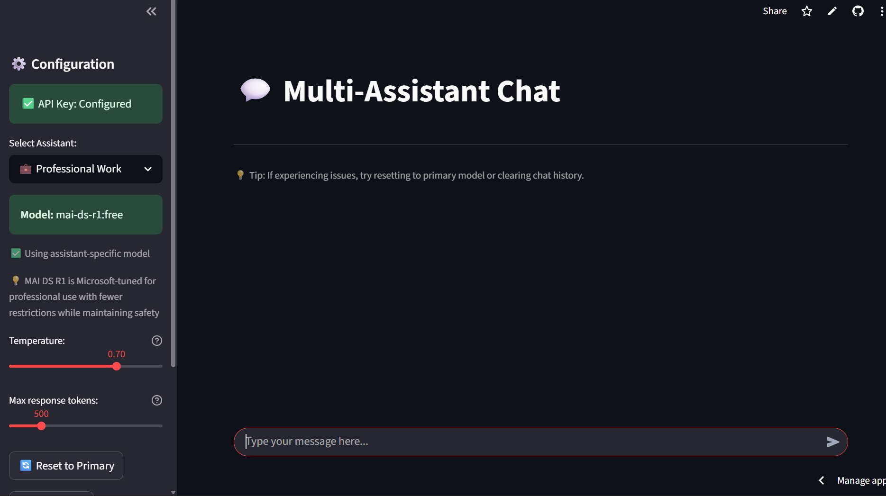
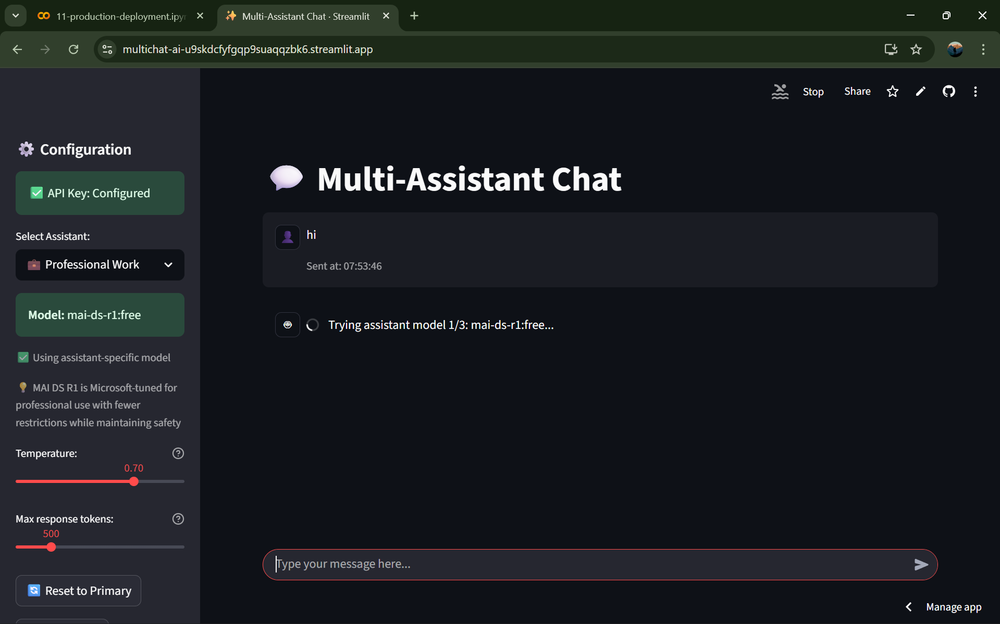

# README.md - Multi-Assistant AI Chatbot 
*for fun project 2 AI Python*

## English Version

### **Multi-Assistant AI Chatbot: Your Intelligent Conversation Partner!**
An interactive AI chatbot application built with Streamlit that integrates with OpenRouter API to provide intelligent responses from various AI models. This project was created for **Fun Project #2 - AI Chatbot dengan Streamlit** and features multiple specialized assistants with a beautiful bubble-style chat interface.

### **Project Description**
Participants will create a Bubble Style AI Chatbot application using Streamlit and OpenRouter API. This application allows users to send messages and get responses from AI in real-time with an interactive chat-like bubble display.

### **Key Features**
- **Bubble Style Chat UI**: Displays user and AI messages with chat bubble styling like modern messaging apps using `st.chat_message` and `st.chat_input`
- **OpenRouter API Integration**: Connects to OpenRouter to get responses from AI models like Mistral using requests library
- **Chat History**: Saves and displays previous conversations for continuous chat experience
- **Dynamic Responses**: Users can type messages and get instant AI responses
- **Multiple AI Assistants**: 6 specialized assistants for different purposes (Professional, Creative, Coding, General, Document Analysis, Advanced Reasoning)
- **Smart Fallback System**: Automatic model switching when primary models fail (3-tier fallback system)
- **Customizable Settings**: Adjustable temperature and token limits for response control
- **Session Management**: Persistent chat history during the session
- **Model Transparency**: Displays which AI model generated each response
- **Rate Limiting**: Prevents spam with 1-second request cooldown
- **Error Handling**: Comprehensive error handling with timeout protection

### **Prerequisites**
Before running, make sure you have:
*   Python 3.7+ installed
*   Package manager `pip`
*   OpenRouter API account (free tier available)

### **How to Run**
1. Ensure Python is installed on your device
2. Install required packages:
   ```bash
   pip install streamlit requests
   ```
3. Clone or download this project
4. Create a `.streamlit/secrets.toml` file in your project directory with your OpenRouter API key:
   ```toml
   OPENROUTER_API_KEY = "your-api-key-here"
   ```
5. Run the application:
   ```bash
   streamlit run app.py
   ```
6. Open your browser and access the displayed address (Example: http://localhost:8501)

### **How to Get OpenRouter API Key**
1. Visit [https://openrouter.ai/](https://openrouter.ai/)
2. Sign up/login with GitHub/Google account
3. Go to "Settings" → "API Keys"
4. Generate a new API key
5. Copy and paste into your `secrets.toml` file

### **How to Use**
1. Select your preferred assistant from the sidebar (6 different specialties available)
2. Adjust temperature (0.0-1.0) and max tokens (100-2000) settings if desired
3. Start chatting by typing your message in the input field at the bottom
4. View responses with model information and timestamps in beautiful chat bubbles
5. Use reset buttons to clear chat or return to primary models
6. Continue chatting - all messages are saved in the session

### **Available Assistants**
- **💼 Professional Work** - Business/education focused responses (Microsoft MAI DS R1)
- **🔓 Uncensored Creative** - Creative brainstorming with minimal filtering (Dolphin Mistral)
- **👨‍💻 Code Development** - Programming and technical assistance (DeepSeek R1)
- **🌐 General Assistant** - Everyday tasks and general questions (Gemini 2.0 Flash)
- **📚 Long Document Analysis** - Large text processing and insights (Grok 4 Fast)
- **🔬 Advanced Reasoning** - Complex problem-solving and logic (DeepSeek V3.1)

### **Project Structure**
```
fun_project_2_REAID/
    - app.py
    - README.md
    - .streamlit/
        - secrets.toml (create this file)
```

## **Application Preview**
### Main Interface


### Chat Processing


### Error Handling


### **Tech Stack & Dependencies**
*   **Language**: Python 3.7+
*   **Framework**: [](https://streamlit.io/)
*   **API**: OpenRouter API
*   **HTTP Requests**: Requests library
*   **Deployment**: Streamlit Community Cloud compatible

### **Development Timeline**
- **Day 1 - Core Features**: Streamlit project setup, basic chat UI, API integration
- **Day 2 - Finishing & Showcase**: Attractive display, error handling, testing and improvements

### **Frequently Asked Questions (FAQ)**

**Q: How reliable are the AI responses?**
A: The application uses a sophisticated 3-tier fallback system to ensure you always get a response. If one model fails, it automatically tries alternative models.

**Q: Do I need to pay for the API?**
A: OpenRouter offers free tier models, but some advanced models may require credits. The app is configured to prioritize free models.

**Q: Are my conversations saved?**
A: Conversations are saved only during your current session. When you refresh or close the browser, the chat history is cleared.

**Q: What happens if all models fail?**
A: The app has an ultimate emergency fallback system that will try the most reliable models as a last resort.

**Q: Can I customize the assistants?**
A: Yes! You can modify the assistant configurations in the code to add new models or change system prompts.

**Q: Why am I getting rate limit warnings?**
A: The app includes rate limiting (1 request per second) to prevent API abuse and ensure stable performance.

### **Troubleshooting**

**Error: API key not found**
- Ensure `.streamlit/secrets.toml` file exists in the correct directory
- Format: `OPENROUTER_API_KEY = "your-key-here"`

**Error: All models failed**
- Check your internet connection
- Verify API key is still valid
- Check quota in OpenRouter dashboard

**Chat not responsive**
- Refresh the browser
- Clear chat history using "Clear Chat" button
- Check rate limiting messages

**Request timeouts**
- The app has 30-second timeout protection
- Try again with a simpler message
- Check your network connection

### **Rate Limits**
- OpenRouter free tier has request limitations
- This app is optimized to use free models efficiently
- If you hit limits, wait a few minutes or upgrade your account

---

## Versi Bahasa Indonesia

### **Multi-Assistant AI Chatbot: Partner Percakapan Cerdas Anda!**
Aplikasi chatbot AI interaktif yang dibangun dengan Streamlit dan terintegrasi dengan API OpenRouter untuk memberikan respons cerdas dari berbagai model AI. Proyek ini dibuat untuk **Fun Project #2 - AI Chatbot dengan Streamlit** dan menampilkan beberapa asisten khusus dengan antarmuka chat bergaya bubble yang menarik.

### **Deskripsi Proyek**
Peserta akan membuat aplikasi AI Chatbot Bubble Style menggunakan Streamlit dan OpenRouter API. Aplikasi ini memungkinkan pengguna untuk mengirim pesan dan mendapatkan respons dari AI secara real-time dengan tampilan ala chat bubble yang interaktif.

### **Fitur Utama**
- **Tampilan Chat Bubble**: Menampilkan pesan pengguna dan AI dengan gaya bubble seperti aplikasi chat modern menggunakan `st.chat_message` dan `st.chat_input`
- **Integrasi OpenRouter API**: Terhubung ke OpenRouter untuk mendapatkan respons dari model AI seperti Mistral menggunakan library requests
- **Riwayat Chat**: Menyimpan dan menampilkan percakapan sebelumnya untuk pengalaman chat yang berkelanjutan
- **Respon Dinamis**: Pengguna dapat mengetik pesan dan mendapatkan respons AI secara instan
- **Multiple AI Assistants**: 6 asisten khusus untuk tujuan berbeda (Profesional, Kreatif, Pemrograman, Umum, Analisis Dokumen, Penalaran Lanjutan)
- **Sistem Fallback Cerdas**: Pergantian model otomatis ketika model utama gagal (sistem fallback 3-tier)
- **Pengaturan yang Dapat Disesuaikan**: Temperature dan batas token yang dapat diatur untuk kontrol respons
- **Manajemen Sesi**: Riwayat chat yang persisten selama sesi
- **Transparansi Model**: Menampilkan model AI mana yang menghasilkan setiap respons
- **Rate Limiting**: Mencegah spam dengan cooldown request 1 detik
- **Penanganan Error**: Penanganan error komprehensif dengan proteksi timeout

### **Prasyarat**
Sebelum menjalankan, pastikan kamu telah memiliki:
*   Python 3.7+ terinstall
*   Package manager `pip`
*   Akun API OpenRouter (tersedia tier gratis)

### **Cara Menjalankan**
1. Pastikan Python terinstall di perangkatmu
2. Install package yang diperlukan:
   ```bash
   pip install streamlit requests
   ```
3. Clone atau download project ini
4. Buat file `.streamlit/secrets.toml` di direktori project dengan API key OpenRouter Anda:
   ```toml
   OPENROUTER_API_KEY = "api-key-anda-di-sini"
   ```
5. Jalankan aplikasi:
   ```bash
   streamlit run app.py
   ```
6. Buka browser dan akses alamat yang ditampilkan (Contoh: http://localhost:8501)

### **Cara Mendapatkan API Key OpenRouter**
1. Kunjungi [https://openrouter.ai/](https://openrouter.ai/)
2. Daftar/login dengan akun GitHub/Google
3. Pergi ke "Settings" → "API Keys"
4. Generate API key baru
5. Salin dan tempel ke file `secrets.toml` Anda

### **Cara Menggunakan**
1. Pilih asisten yang diinginkan dari sidebar (6 spesialisasi berbeda tersedia)
2. Sesuaikan pengaturan temperature (0.0-1.0) dan max tokens (100-2000) jika diperlukan
3. Mulai chatting dengan mengetik pesan di kolom input bagian bawah
4. Lihat respons dengan informasi model dan timestamp dalam bubble chat yang menarik
5. Gunakan tombol reset untuk menghapus chat atau kembali ke model utama
6. Lanjutkan chatting - semua pesan disimpan dalam sesi

### **Asisten yang Tersedia**
- **💼 Professional Work** - Respons fokus bisnis/pendidikan (Microsoft MAI DS R1)
- **🔓 Uncensored Creative** - Brainstorming kreatif dengan filter minimal (Dolphin Mistral)
- **👨‍💻 Code Development** - Bantuan pemrograman dan teknis (DeepSeek R1)
- **🌐 General Assistant** - Tugas sehari-hari dan pertanyaan umum (Gemini 2.0 Flash)
- **📚 Long Document Analysis** - Pemrosesan teks besar dan insight (Grok 4 Fast)
- **🔬 Advanced Reasoning** - Pemecahan masalah kompleks dan logika (DeepSeek V3.1)

### **Struktur Proyek**
```
fun_project_2_REAID/
    - app.py
    - README.md
    - .streamlit/
        - secrets.toml (buat file ini)
```

## **Preview Aplikasi**
### Main Interface


### Chat Processing


### Error Handling


### **Tech Stack & Dependencies**
*   **Bahasa**: Python 3.7+
*   **Framework**: [](https://streamlit.io/)
*   **API**: OpenRouter API
*   **HTTP Requests**: Requests library
*   **Deployment**: Compatible dengan Streamlit Community Cloud

### **Timeline Pengembangan**
- **Hari 1 - Fitur Inti**: Setup proyek Streamlit, UI chat dasar, integrasi API
- **Hari 2 - Penyelesaian & Showcase**: Tampilan menarik, penanganan error, testing dan perbaikan

### **Pertanyaan Umum (FAQ)**

**Q: Seberapa reliable respons AI yang diberikan?**
A: Aplikasi menggunakan sistem fallback 3-tier yang canggih untuk memastikan Anda selalu mendapatkan respons. Jika satu model gagal, secara otomatis akan mencoba model alternatif.

**Q: Apakah perlu bayar untuk API?**
A: OpenRouter menawarkan model tier gratis, tetapi beberapa model advanced mungkin memerlukan kredit. Aplikasi dikonfigurasi untuk memprioritaskan model gratis.

**Q: Apakah percakapan saya disimpan?**
A: Percakapan hanya disimpan selama sesi Anda berlangsung. Ketika refresh atau tutup browser, riwayat chat akan dihapus.

**Q: Apa yang terjadi jika semua model gagal?**
A: Aplikasi memiliki sistem fallback emergency ultimate yang akan mencoba model paling reliable sebagai upaya terakhir.

**Q: Bisakah saya menyesuaikan asisten?**
A: Ya! Anda dapat memodifikasi konfigurasi asisten dalam kode untuk menambah model baru atau mengubah system prompt.

**Q: Mengapa saya mendapatkan peringatan rate limit?**
A: Aplikasi termasuk rate limiting (1 request per detik) untuk mencegah penyalahgunaan API dan memastikan performa stabil.

### **Pemecahan Masalah**

**Error: API key tidak ditemukan**
- Pastikan file `.streamlit/secrets.toml` ada di direktori yang benar
- Format: `OPENROUTER_API_KEY = "api-key-anda-di-sini"`

**Error: Semua model gagal**
- Cek koneksi internet Anda
- Verifikasi API key masih valid
- Cek kuota di dashboard OpenRouter

**Chat tidak responsif**
- Refresh browser
- Hapus riwayat chat menggunakan tombol "Clear Chat"
- Cek pesan rate limiting

**Request timeout**
- Aplikasi memiliki proteksi timeout 30 detik
- Coba lagi dengan pesan yang lebih sederhana
- Cek koneksi jaringan Anda

### **Batas Rate**
- OpenRouter free tier memiliki batasan request
- Aplikasi ini dioptimalkan untuk menggunakan model gratis secara efisien
- Jika mencapai limit, tunggu beberapa menit atau upgrade akun

---

**Dibuat untuk Fun Project #2 - AI Chatbot dengan Streamlit**  
**Deadline: 23 September 2025 (23:59 WIB)**  
**Dibuat dengan ❤️ menggunakan Streamlit dan OpenRouter API**
